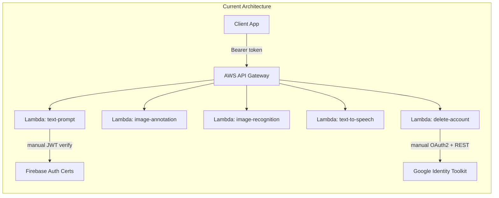
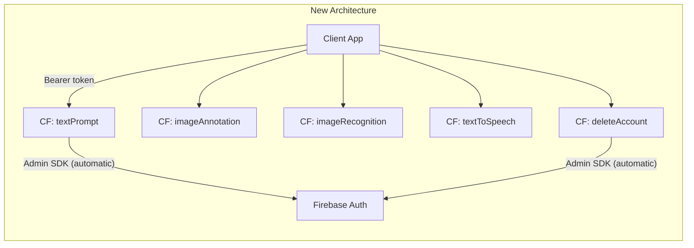

# Migrate AWS Lambdas to Cloud Functions for Firebase v2

## Architecture Before vs After




## Key Decisions

- **Cloud Functions for Firebase v2** (`firebase-functions/v2/https`) -- HTTP-triggered, built on Cloud Run, supports concurrency
- **Firebase Admin SDK** replaces both `auth.mjs` (125 lines of manual JWT verification) and `google-service.mjs` (120 lines of manual OAuth2 token exchange)
- **No more webpack** -- Firebase CLI deploys source directly (with optional predeploy build step if needed); tree-shaking is unnecessary for server-side code
- **No more API Gateway** -- Cloud Functions for Firebase v2 get their own HTTPS endpoints automatically
- **Secrets** -- `OPENAI_API_KEY` moves to Firebase Functions secrets (`firebase functions:secrets:set`); `GOOGLE_SERVICE_ACCOUNT_KEY` and `FIREBASE_PROJECT_ID` are eliminated entirely (Admin SDK auto-detects)

## Phase 0: Preserve Current Code

Branch the current AWS Lambda code before making changes:

```
git checkout -b aws-lambda-archive
git push -u origin aws-lambda-archive
git checkout main
```

## Phase 1: Project Setup

### 1.1 Install Firebase CLI (if not already installed)

```
npm install -g firebase-tools
firebase login
```

### 1.2 Initialize Firebase Functions

Create [firebase.json](firebase.json):

```json
{
  "functions": {
    "source": ".",
    "runtime": "nodejs22"
  }
}
```

Create [.firebaserc](.firebaserc) (links to existing Firebase project):

```json
{
  "projects": {
    "default": "<FIREBASE_PROJECT_ID>"
  }
}
```

### 1.3 Update [package.json](package.json)

**Add dependencies:**

- `firebase-admin` -- Admin SDK for auth verification and user deletion
- `firebase-functions` -- Cloud Functions v2 framework

**Remove dependencies:**

- `jose` -- no longer needed (Admin SDK handles JWT verification)

**Remove devDependencies:**

- `webpack`, `webpack-cli`, `terser-webpack-plugin` -- no longer needed

**Add `engines` field** (Firebase requires explicit Node version):

```json
"engines": { "node": "22" }
```

**Update `main`** to point to the new entry file:

```json
"main": "index.mjs"
```

**Replace all scripts** with Firebase equivalents:

```json
"deploy": "firebase deploy --only functions",
"deploy:textPrompt": "firebase deploy --only functions:textPrompt",
"serve": "firebase emulators:start --only functions",
"logs": "firebase functions:log"
```

### 1.4 Delete build artifacts and config

- Delete [webpack.config.js](webpack.config.js)
- Delete `dist/` directory
- Delete `lambda-function.zip` if present

## Phase 2: Rewrite Shared Modules

### 2.1 Rewrite [auth.mjs](auth.mjs) (~125 lines to ~20 lines)

Replace the entire manual JWT verification (cert fetching, caching, X.509 import, `jose` calls) with:

```javascript
import { getAuth } from "firebase-admin/auth";

export const requireAuth = async (req) => {
    const auth = req.headers.authorization;
    if (!auth?.startsWith("Bearer ")) {
        const err = new Error("unauthorized");
        err.statusCode = 401;
        throw err;
    }
    try {
        return await getAuth().verifyIdToken(auth.slice(7).trim());
    } catch (e) {
        const err = new Error("unauthorized");
        err.statusCode = 401;
        err.cause = e;
        throw err;
    }
};
```

Note: the signature changes from `requireAuth(event)` (Lambda event) to `requireAuth(req)` (Express-like request). The `req.headers` API is the same shape, so the change is minimal.

### 2.2 Rewrite [google-service.mjs](google-service.mjs) (~120 lines to ~15 lines)

Replace manual service account JWT signing, OAuth2 token exchange, and Identity Toolkit REST call with:

```javascript
import { getAuth } from "firebase-admin/auth";

export const deleteFirebaseUser = async (uid) => {
    if (!uid || typeof uid !== "string") {
        const err = new Error("uid is required");
        err.statusCode = 400;
        throw err;
    }
    await getAuth().deleteUser(uid);
    console.log("google-service: user %s deleted", uid);
    return { deleted: true };
};
```

### 2.3 Simplify [event-utils.mjs](event-utils.mjs)

- **Remove `parseRequestBody`** entirely -- Cloud Functions automatically parse JSON request bodies into `req.body`
- **Keep `validateMandatoryFields`** as-is (still useful)

## Phase 3: Convert Handlers

### Conversion pattern

Every handler follows the same transformation. The Lambda pattern:

```javascript
export const handler = async (event) => {
    const decoded = await requireAuth(event);
    const input = parseRequestBody(event);
    // ... business logic ...
    return { statusCode: 200, headers: {...}, body: JSON.stringify(result) };
};
```

Becomes the Cloud Functions v2 pattern:

```javascript
import { onRequest } from "firebase-functions/v2/https";

export const functionName = onRequest({ cors: true }, async (req, res) => {
    const decoded = await requireAuth(req);
    const input = req.body;
    // ... business logic (unchanged) ...
    res.json(result);
});
```

Key differences per handler:

- `event` becomes `req` (Express-like Request)
- `parseRequestBody(event)` becomes `req.body` (auto-parsed)
- Return `{ statusCode, body }` becomes `res.status(code).json(body)`
- CORS header is handled by `{ cors: true }` option instead of manual headers
- Error responses: `return toHttpResponse(statusCode, errorBody)` becomes `res.status(statusCode).json(errorBody)`
- The `toHttpResponse` helper is **deleted** from every handler

### 3.1 Rename directory

Rename `lambdas/` to `handlers/` to reflect the platform change.

### 3.2 Convert each handler

| Current file | New file | Notes |

|---|---|---|

| `lambdas/ramblex-text-prompt-lambda.mjs` | `handlers/text-prompt.mjs` | Drop `parseRequestBody`, use `req.body` |

| `lambdas/ramblex-image-annotation-lambda.mjs` | `handlers/image-annotation.mjs` | Same pattern |

| `lambdas/ramblex-image-recognition-lambda.mjs` | `handlers/image-recognition.mjs` | Same pattern |

| `lambdas/ramblex-text-to-speech-lambda.mjs` | `handlers/text-to-speech.mjs` | Same pattern |

| `lambdas/ramblex-delete-account-lambda.mjs` | `handlers/delete-account.mjs` | `deleteFirebaseUser` now uses Admin SDK |

### 3.3 Create entry point [index.mjs](index.mjs)

New file at project root -- the single entry point that Firebase CLI uses to discover all functions:

```javascript
import { initializeApp } from "firebase-admin/app";

initializeApp();

export { textPrompt } from "./handlers/text-prompt.mjs";
export { imageAnnotation } from "./handlers/image-annotation.mjs";
export { imageRecognition } from "./handlers/image-recognition.mjs";
export { textToSpeech } from "./handlers/text-to-speech.mjs";
export { deleteAccount } from "./handlers/delete-account.mjs";
```

`initializeApp()` is called once here (not in each handler). It auto-detects the project ID and default service account credentials when running on Google Cloud.

## Phase 4: Secrets and Environment Variables

| Current env var | Action |

|---|---|

| `OPENAI_API_KEY` | Migrate to Firebase secrets: `firebase functions:secrets:set OPENAI_API_KEY` |

| `FIREBASE_PROJECT_ID` | **Delete** -- auto-detected by Admin SDK |

| `GOOGLE_SERVICE_ACCOUNT_KEY` | **Delete** -- default service account used automatically |

In each handler that uses OpenAI, reference the secret:

```javascript
import { defineSecret } from "firebase-functions/params";
const openaiApiKey = defineSecret("OPENAI_API_KEY");

export const textPrompt = onRequest(
    { cors: true, secrets: [openaiApiKey] },
    async (req, res) => { ... }
);
```

Update [open-ai-service.mjs](open-ai-service.mjs) to accept the API key as a parameter (since `process.env.OPENAI_API_KEY` is only available inside the function scope when using secrets), or rely on the fact that Firebase secrets are injected as env vars at runtime (which means `process.env.OPENAI_API_KEY` still works inside the handler). The latter requires listing the secret in the `onRequest` options but needs no code change in `open-ai-service.mjs`.

## Phase 5: Test Locally

```bash
firebase emulators:start --only functions
```

Test each endpoint with curl:

```bash
curl -X POST http://localhost:5001/<project-id>/<region>/textPrompt \
  -H "Authorization: Bearer <firebase-id-token>" \
  -H "Content-Type: application/json" \
  -d '{"input": "Tell me about the Eiffel Tower", "persona": "blogger", "language": "English"}'
```

Repeat for all 5 functions. The business logic (OpenAI calls, prompt construction) is unchanged, so testing focuses on the HTTP plumbing.

## Phase 6: Deploy

```bash
firebase deploy --only functions
```

Firebase CLI will:

1. Upload the source code
2. Build and deploy each exported function as a separate Cloud Function
3. Print the HTTPS URL for each function

### 6.1 Update client app

Replace the AWS API Gateway URLs with the new Cloud Functions URLs in your client app. The URL format will be:

```
https://<region>-<project-id>.cloudfunctions.net/textPrompt
```

## Phase 7: Cleanup

- Remove any remaining AWS-specific files (`lambda-function.zip`, `dist/`)
- Update `.gitignore` to exclude Firebase emulator data (`.firebase/`, `firebase-debug.log`)
- Optionally decommission the AWS Lambda functions and API Gateway in the AWS Console

## Files Changed Summary

| File | Action |

|---|---|

| `firebase.json` | **Create** -- Firebase project config |

| `.firebaserc` | **Create** -- project alias |

| `index.mjs` | **Create** -- entry point exporting all functions |

| `handlers/text-prompt.mjs` | **Create** (replaces `lambdas/ramblex-text-prompt-lambda.mjs`) |

| `handlers/image-annotation.mjs` | **Create** (replaces `lambdas/ramblex-image-annotation-lambda.mjs`) |

| `handlers/image-recognition.mjs` | **Create** (replaces `lambdas/ramblex-image-recognition-lambda.mjs`) |

| `handlers/text-to-speech.mjs` | **Create** (replaces `lambdas/ramblex-text-to-speech-lambda.mjs`) |

| `handlers/delete-account.mjs` | **Create** (replaces `lambdas/ramblex-delete-account-lambda.mjs`) |

| `auth.mjs` | **Rewrite** -- Firebase Admin SDK |

| `google-service.mjs` | **Rewrite** -- Firebase Admin SDK |

| `event-utils.mjs` | **Simplify** -- remove `parseRequestBody`, keep `validateMandatoryFields` |

| `package.json` | **Update** -- deps, scripts, engines, main |

| `open-ai-service.mjs` | **No change** |

| `system-prompt.mjs` | **No change** |

| `prompts.mjs` | **No change** |

| `webpack.config.js` | **Delete** |

| `lambdas/` | **Delete** (after creating `handlers/`) |

## Lines of Code Impact

- **Deleted**: ~245 lines (auth.mjs manual JWT, google-service.mjs manual OAuth2, parseRequestBody, toHttpResponse helpers, webpack config)
- **Added**: ~35 lines (Firebase Admin init, simplified auth, new entry point)
- **Net reduction**: ~210 lines removed